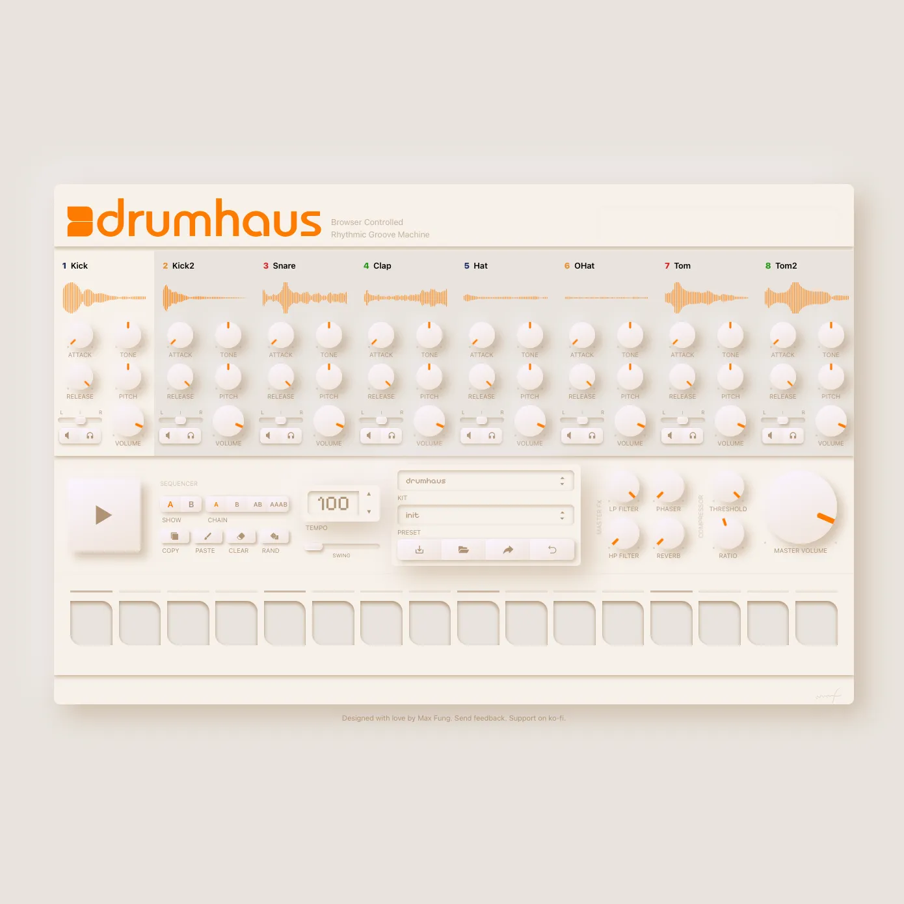
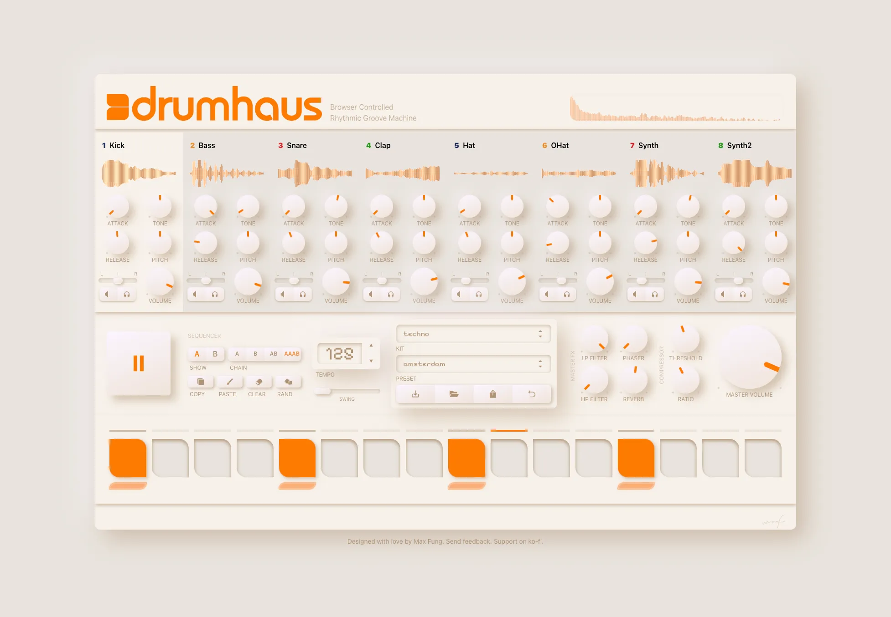
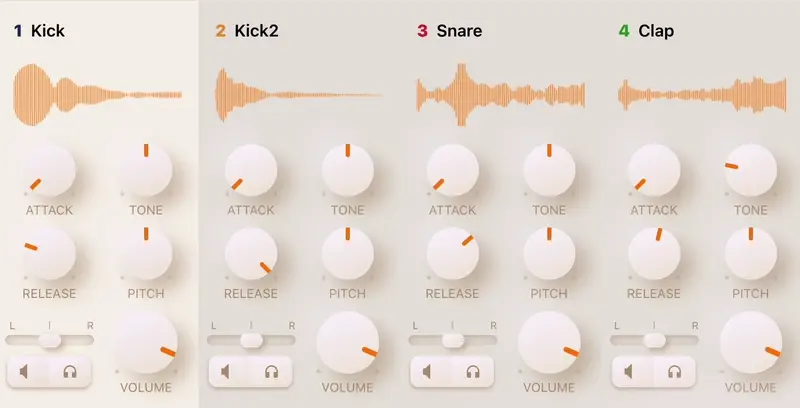

A year ago today, I released Drumhaus, a browser-native drum machine. My goal was to re-imagine the classic hardware sequencer through the lens of modern web technologies. Designed and built using Tone.js and the Web Audio API, Drumhaus enables users to create their own beats with its sequencing and sampling capabilities. The user interface takes playful inspiration from the classic Roland TR-909 and the skeumorphic designs of VST instruments.

The project blends a lifelong love of beat-making with a curiosity for digital audio systems and creative tooling. The interface offers two 16-step pattern variations across eight sampled instruments, paired with a curated library of kits and presets. Compact, open-source, and freely available online, Drumhaus invites users to explore rhythm and sound without barriers. It is a playground for producers at any level.

This was a personal attempt to fuse code and creativity, and to build something I wish had existed when I first started making music.

[See it live](https://drumhaus.maxfu.ng/)
