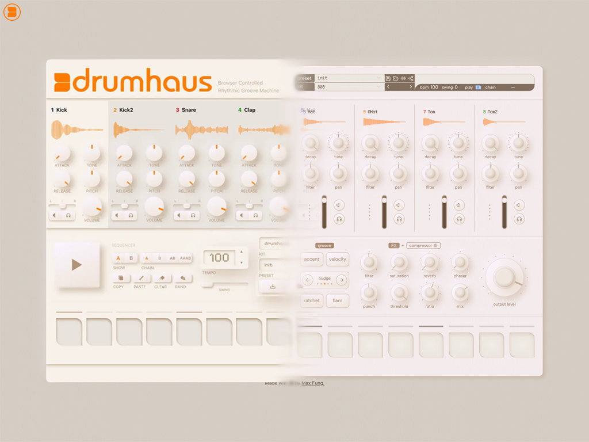
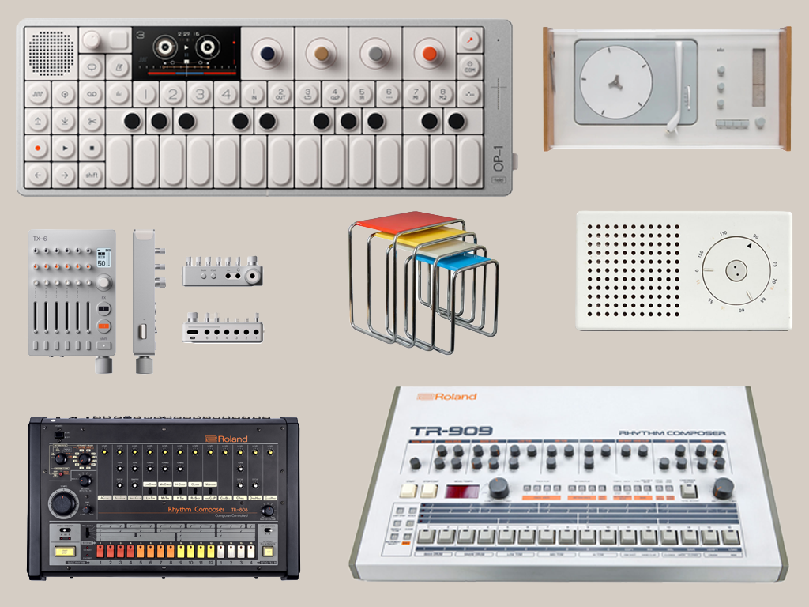
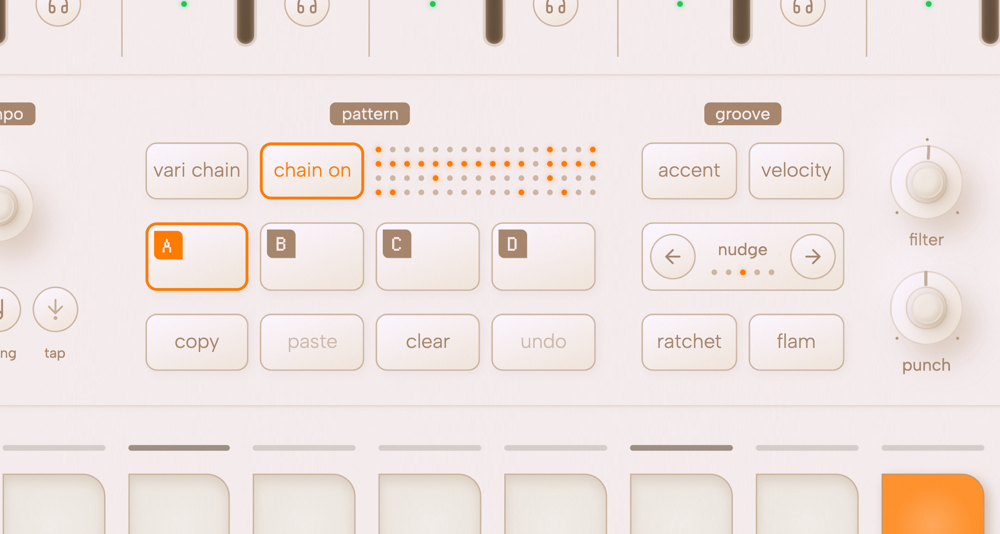
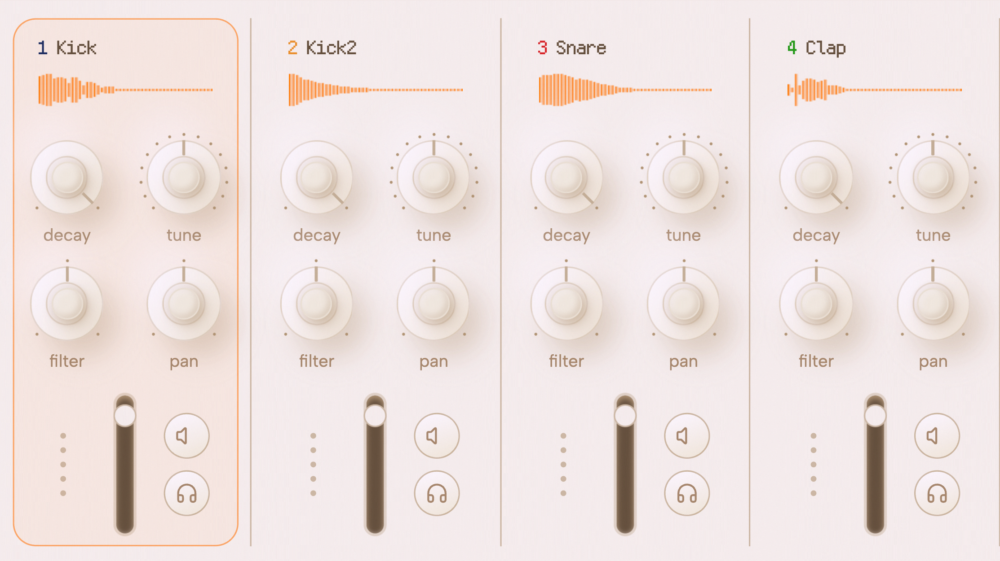

In late 2023, I built Drumhaus, a browser-native drum machine powered by Tone.js and the Web Audio API. It was a passion project born from an obsession with the tools behind my music, a way to combine code and music in the form of an instrument anyone could play on the web. I shipped it and shared it on [Reddit](https://www.reddit.com/r/InternetIsBeautiful/comments/183pvg0/i_built_a_web_based_drum_machine_using_nextjs_and/).

Organically, it attracted hundreds of thousands of visitors and lots of emails from folks around the world. Some stars, some forks, and a few genuine spinoff projects inspired by it. I was amazed at all the joy it brought people, but the irony was, after a short while, I'd moved on creatively, and this beautiful gem sat collecting dust for nearly two years.

I'm not entirely sure what pulled me back to it. It always felt slightly unfinished. Features I'd imagined but never built, limitations I'd learned to live with. I was itching for a new project, but the answer had been sitting right in front of me the whole time.

In mid-November 2025, I opened the codebase and started writing. At first, I just wanted to audit and refactor things now that I was two years wiser as a developer. What followed was five weeks of the most intense, sustained creative work I've ever done. I woke up every morning and sat down at my desk for 12, sometimes 14 hours a day, rebuilding Drumhaus from the ground up. I went absolutely insane. I couldn't stop.

The result is Drumhaus v1: the instrument I originally envisioned, and finally had the skill and stamina to build.

## What changed

At this point, it might be easier to ask, what didn't change?

I gutted the entire tech stack. [Next.js](https://nextjs.org/), [Redux](https://redux.js.org/), [Chakra UI](https://www.chakra-ui.com/), a [Postgres](https://www.postgresql.org/) database for storing shared presets. All of it went out the window. Things needed to be simpler. In its place: [Vite](https://vite.dev/), [Zustand](https://zustand-demo.pmnd.rs/) with [Immer](https://immerjs.github.io/immer/), [Tailwind v4](https://tailwindcss.com/blog/tailwindcss-v4), [Radix UI primitives](https://www.radix-ui.com/primitives), and a custom client-side preset serialization system that [compresses full rig snapshots into ~200 character URL parameters](https://github.com/mxfng/drumhaus/tree/main/src/features/preset/lib/serialization) using bit-packing and [pako](https://github.com/nodeca/pako). No server, no database, no dependencies I don't control. Drumhaus is now a fully static, offline-capable PWA that loads fast and runs anywhere.

But the tech stack swap was just the foundation. The story would be really boring if I had stopped there. Luckily, the real work was in re-inventing the instrument itself. Things started slowly. Tiny adjustments here and there. I was tiptoeing around the original interface, believing there was a soul to this product that I refused to trample on by being reckless.

## Design intent

Eventually, the tiptoeing stopped. After many hours of staring at the same interface while testing the redesign, something about the layout felt off. I spent a week studying the instruments and designers I admired most. The Teenage Engineering [OP-1](https://en.wikipedia.org/wiki/Teenage_Engineering_OP-1) and [TX-6](https://en.wikipedia.org/wiki/Teenage_Engineering#Products). The Roland [TR-1000](https://en.wikipedia.org/wiki/Roland_TR-8S) and legacy models like the [TR-808](https://en.wikipedia.org/wiki/Roland_TR-808) and [909](https://en.wikipedia.org/wiki/Roland_TR-909). [Dieter Rams](https://en.wikipedia.org/wiki/Dieter_Rams)' work at Braun, and the industrial design lineage Apple and [Jony Ive](https://en.wikipedia.org/wiki/Jony_Ive) carried forward from it. I took some time to reflect and learn more about the history of [Bauhaus](https://en.wikipedia.org/wiki/Bauhaus), which inspired this product's name, and its very DNA.

I wanted Drumhaus to feel rooted in that tradition — future-thinking, but built on proven design principles. Everything should be visible on the screen in front of you, like a physical product. Dense with controls, but visually calm, symmetrical, and balanced. Nested menus were the antithesis of what I was trying to build. The layout should group product functions logically and in an aesthetically pleasing way. Through use, the tool's abilities should reveal themselves to the user organically. Every knob, label, and grid cell earned its place or got cut.

## The sequencer

<video autoplay muted loop playsinline>
  <source src="/writing/announcing-drumhaus-v1/drumhaus-sequence-editing.mp4" type="video/mp4" />
</video>

The sequencer is the core of Drumhaus. It's the primary interface between the user and the sound. It's also where the audio engine diverges most from a standard Tone.js implementation. The original sequencer supported two variations — A and B — with four chain modes. It worked, but it was limiting. v1 expands this to four full variations (A through D), chainable in any combination up to 8 bars. You can program complex, evolving patterns that develop over time, with a live step indicator so you always know where you are in the sequence.

<video autoplay muted loop playsinline>
  <source src="/writing/announcing-drumhaus-v1/drumhaus-sequence-chaining.mp4" type="video/mp4" />
</video>

Beyond structure, I added the micro-rhythm tools I'd been dreaming about since the beginning: per-step velocity, flam, ratchet, and accent controls, plus per-voice timing nudges. These are the kinds of features that separate a toy from an instrument. Flam staggers a hit into a quick double strike. Ratchet repeats a step at subdivisions for rolls and fills. Accent, a nod to the legendary Roland TR-909, punches through the mix. Timing nudges let you push or pull a voice slightly off the grid, adding complexity to the groove that makes the rhythm sound more human-like.

## Sound shaping

Each of the eight voices now has a richer set of per-channel controls: a decay envelope, split high-pass and low-pass filters, panning, volume, semitone pitch adjustment, and mute/solo. The master bus gained saturation and level controls alongside the existing filters, phaser, reverb, and compressor.

The knobs were one of the best things about the original product. For v1, the rotary controls themselves were rebuilt with logarithmic curves and split ranges that respond musically — a frequency knob doesn't just sweep linearly from 20 Hz to 20 kHz, it follows a curve that matches how we actually hear. The mapping system is explicitly declared and shared across the codebase, so live playback and offline export always produce identical results.

## Performance

This is where I probably lost the most sleep. The original version worked fine for casual use, but I wanted Drumhaus to feel tight — instrument tight. I rewrote the audio engine to precompute patterns on every update, eliminating runtime overhead during playback. I built a centralized animation clock that synchronizes all visual feedback to a shared frame timeline, pauses when playback stops, and supports throttling on low-power devices. The sample visualizers now consume pre-bucketized waveform JSON generated by a custom TypeScript build script, replacing the old Python/librosa pipeline.

The intro animation was the stress test that forced all of this to come together. When the app loads, a wave of light sweeps across the entire interface — every sequencer step, every indicator, every variation preview lights up and fades in sequence. Hundreds of elements, animated in sync. Under the hood, each component registers itself with a central light rig provider, which reads their positions on screen at runtime using `getBoundingClientRect()`. A spatial sorting algorithm orders them by their X and Y coordinates, then schedules a sweep across the layout. The key breakthrough was avoiding React re-renders entirely — instead of toggling state and letting React diff and reconcile on every frame, the system writes directly to the DOM via data attributes, and CSS transitions handle the visual response. All of it runs on the shared animation clock, batched into a single frame budget. The result is a smooth 60 FPS lightshow across a dense, control-heavy interface — and the same pattern keeps the sequencer's step indicators and playback visuals jank-free during normal use.

<video autoplay muted loop playsinline>
  <source src="/writing/announcing-drumhaus-v1/drumhaus-intro-animation.mp4" type="video/mp4" />
</video>

For devices that still struggle, there's potato mode — a single toggle that strips back all non-essential rendering so the audio engine can breathe. This was born out of a futile attempt to get Drumhaus to run smoothly on a really bottom of the barrel Android browser, and while it didn't end up working, I kept potato mode in the app because it's a really funny concept to include.

## Everything else

Some features are hard to categorize but made a huge difference in how the app feels:

- **Click-drag step entry** — paint notes across the grid in one motion instead of clicking each cell.
- **Copy, paste, and clear** — for individual voices or entire variations to move ideas around quickly.

<video autoplay muted loop playsinline>
  <source src="/writing/announcing-drumhaus-v1/drumhaus-copy-paste.mp4" type="video/mp4" />
</video>

- **Keyboard shortcuts** — for the power users who want to keep their hands on the keys.
- **WAV export** — render your pattern to a file via Tone.js offline rendering, with bar-length suggestions and optional tail for FX decay.
- **Night mode** — a dark theme with an animated sky.

<video autoplay muted loop playsinline>
  <source src="/writing/announcing-drumhaus-v1/drumhaus-night-mode.mp4" type="video/mp4" />
</video>

- **Responsive layout scaling** — Drumhaus adapts to your screen size, scaling its dense interface to fit different desktop resolutions.
- **Preset system overhaul** — save to local memory, export as `.dh` files, reload from disk, or share as compressed URLs. The entire rig state — patterns, kits, FX, BPM, swing — travels in a link.

## By the numbers

The rewrite spanned November 16 to December 19, 2025 — 34 calendar days, 25 working days, 165 commits. The first two weeks were the most unhinged: 13 working days out of 14 calendar days, including a 12-day consecutive streak. Across the whole project, that averaged out to 6.6 commits and ~5,800 lines touched per working day.

The source code grew from ~9,400 lines across 49 files to ~22,000 lines across 237 files. Components went from 25 to 98. The app gained 34 custom hooks and 12 store modules. The total diff: +93,000 insertions, -52,000 deletions across 512 files. The single largest commit — the Zustand migration and core data structure redesign — touched 28,700 lines alone.

## Reflection

I wrote an essay called Momentum a couple weeks before I started this rewrite. In it, I described a pattern I'd recognized in myself: intense acceleration followed by exhaustion and abandonment. The fear of watching passions drift onto a shelf. A desire to stop treating creative work as a sprint and start treating it as a practice.

Which is hilarious, because I then proceeded to immediately sprint for five weeks straight to ship this thing.

Maybe there's a lesson for me to learn somewhere in all this chaos. That I should lean into my strengths, and worry less about perfecting the routine. That I can build discipline by returning to something I've already built, something I believed in, and finishing what I started. I rewrote systems I'd written two years prior with two more years of experience. I could feel it in the architecture, in the ergonomics of the code, in the details I now had the skill to get right. There's a particular kind of satisfaction in building the thing you couldn't build before.

Drumhaus started as a curiosity about what was possible in a browser. v1 is an answer: more than I expected.

[See it live](https://drumha.us)

[Drumhaus source](https://github.com/mxfng/drumhaus)
