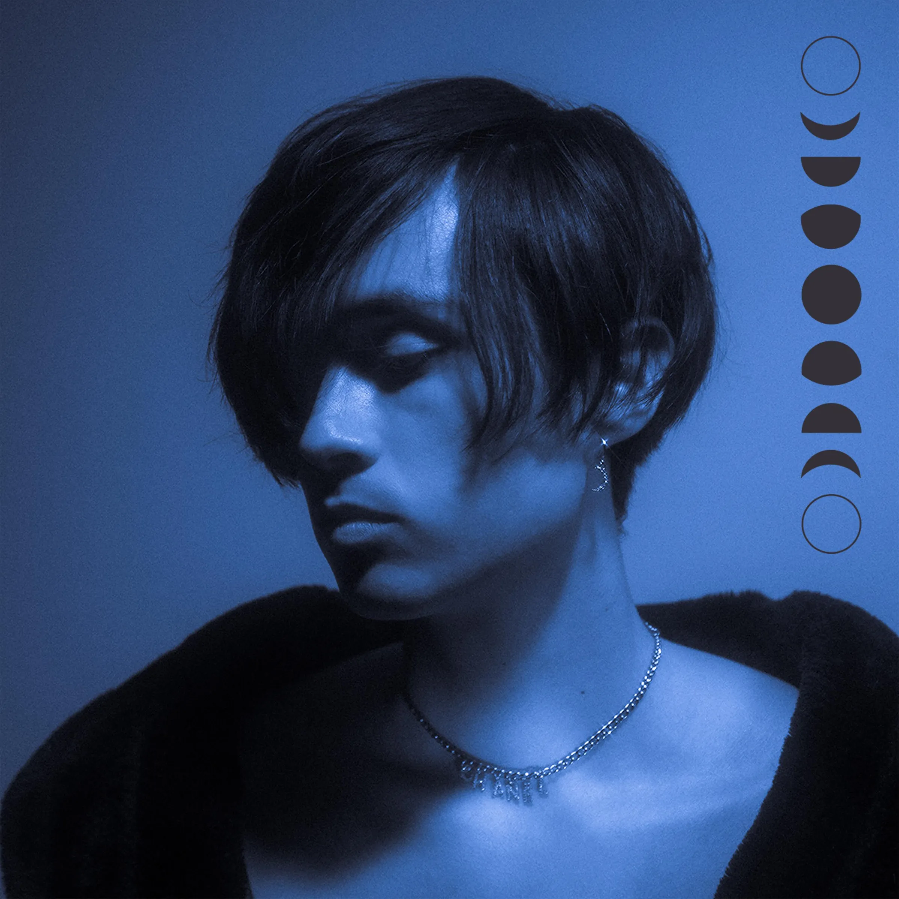
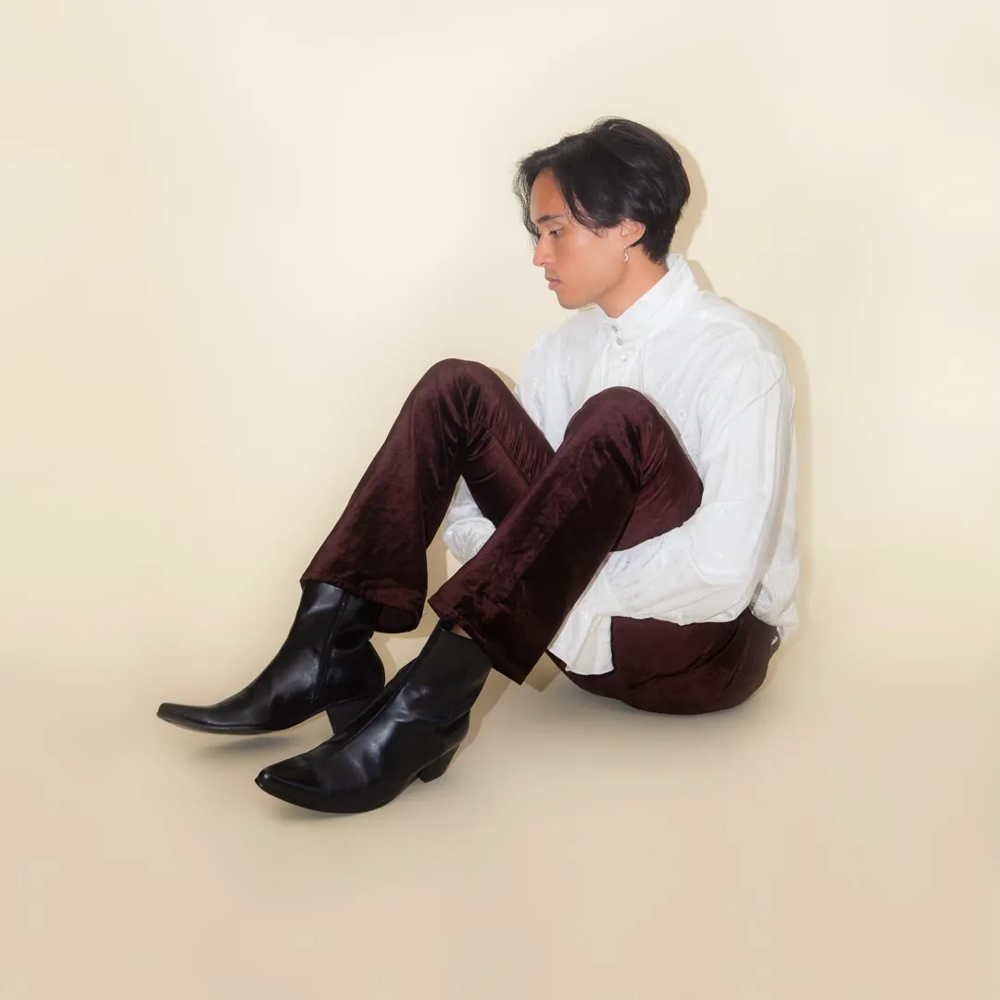
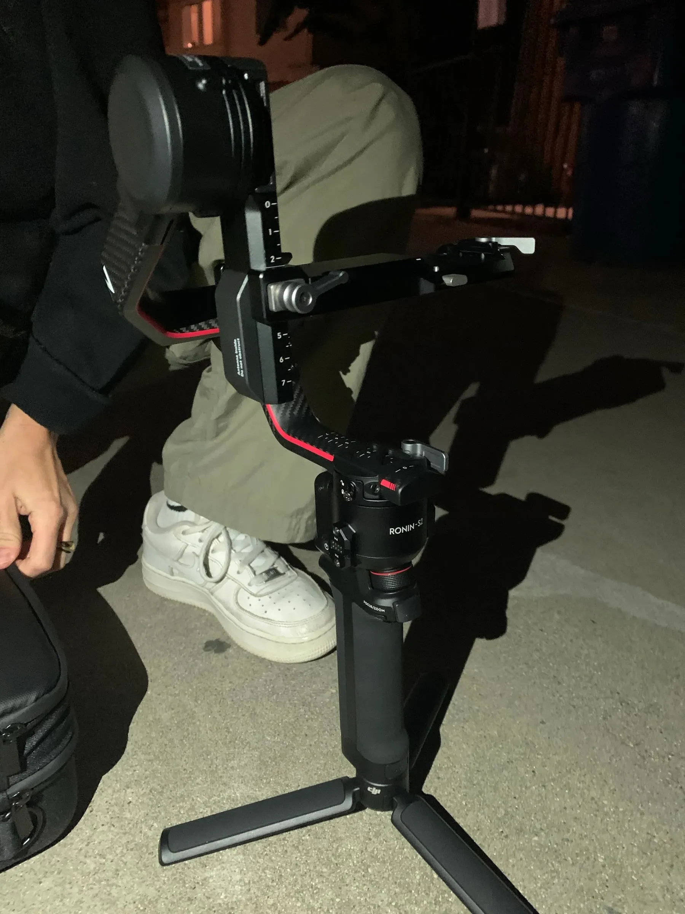
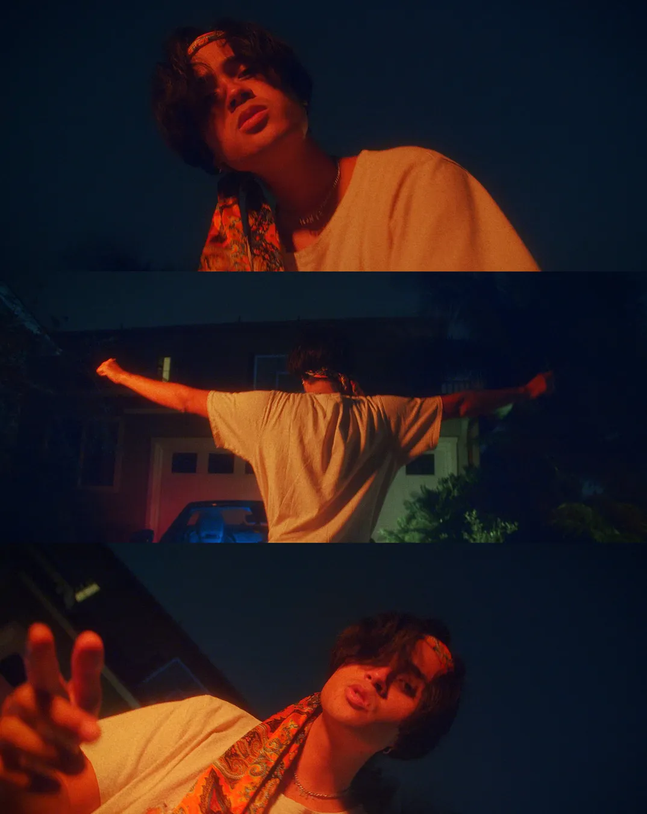
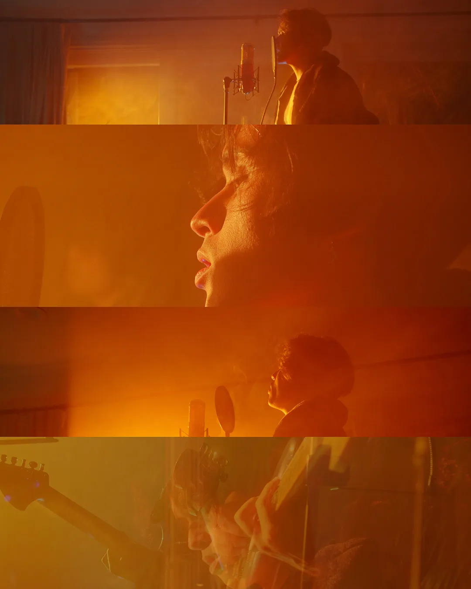
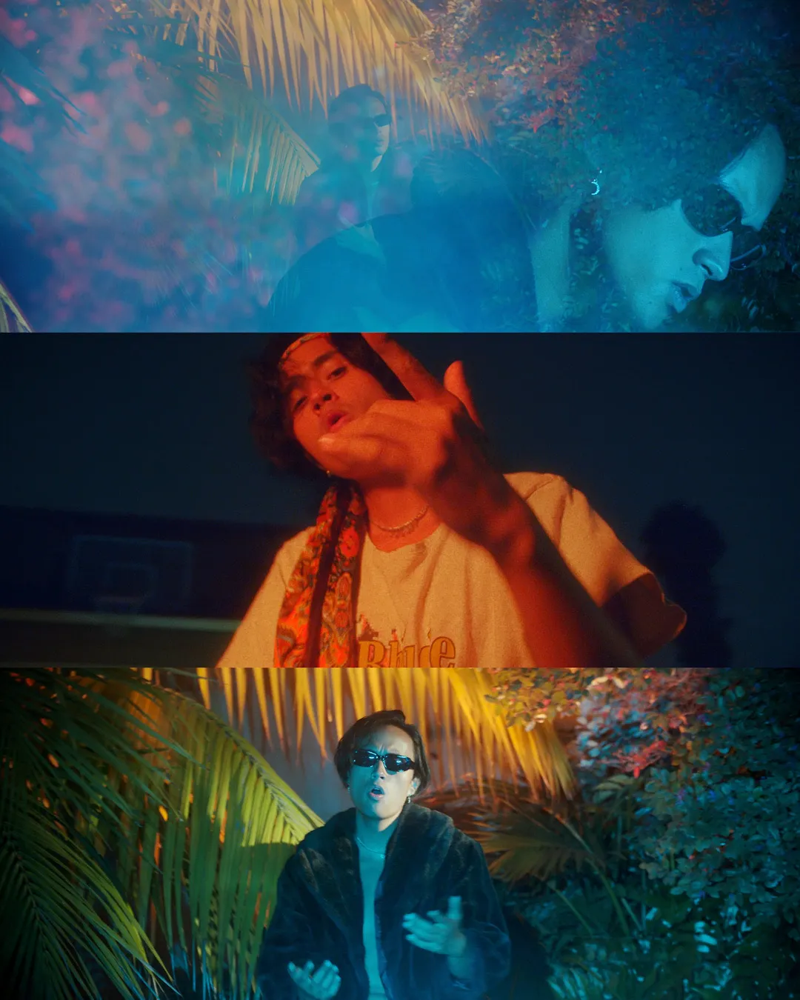
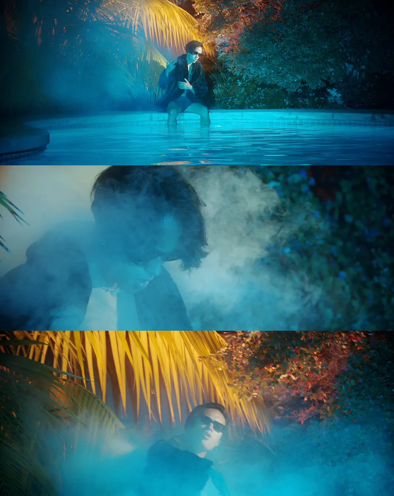
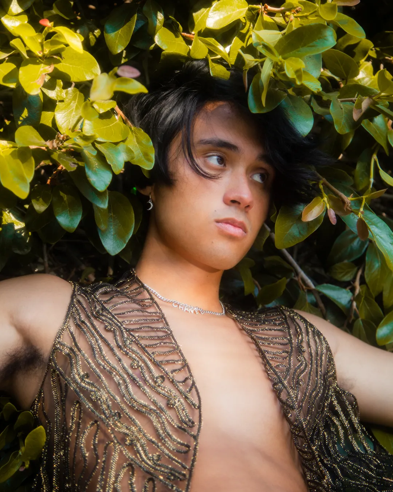
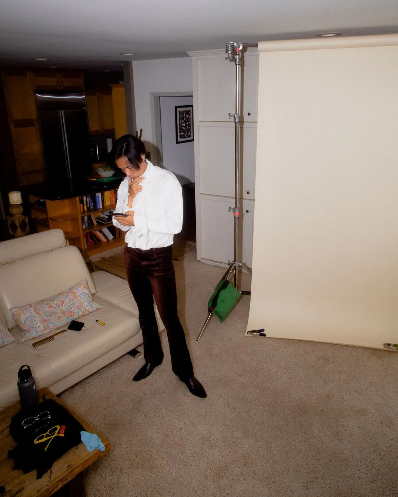
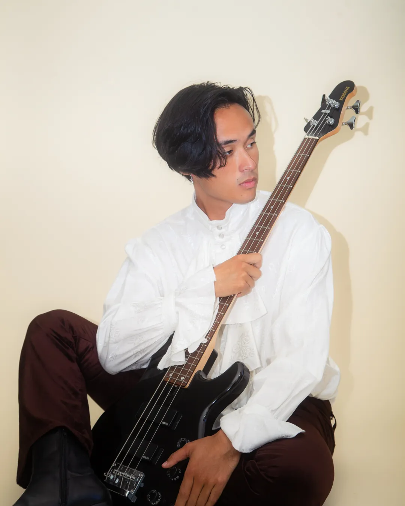

Blue Moon represented the many late nights I spent up writing melancholy, nostalgic, and downright haunting songs in my bedroom studio in Playa del Rey. I had gone through a long period of being out on my own for the very first time, and this mixture of newfound independence and a deep sense of longing for intimacy culminated in a creative flurry of musical experimentation and boundary pushing. It was also a playful nod at the partying I was doing during my last year of college.

By the end of 2020, I had accumulated a handful of exciting tracks that defied any single genre and proved to be a risky but rewarding follow-on to the very compact and focused R&B/Pop work I did on my prior EP. I had been listening to a ton of Frank Ocean and Jimi Hendrix during this time, and looking back, their stylistic influence was extremely clear on my creative output.

<iframe width="100%" height="400" src="https://www.youtube.com/embed/vXpejWS-UjU" frameborder="0" allowfullscreen title="Max Fung - Honesty (Trailer)" loading="lazy"></iframe>

This all had me playing my guitar a lot more, and the bluesy style was rubbing off on my writing, which you can hear very clearly in the opening track, Restless. George Floyd had been killed recently and the Black Lives Matter protests were going full force, which inspired chaotic lyrics grappling between hope and hopelessness, reflecting how I was feeling about the state of the world.

This new EP had gone through several scraps and iterations before manifesting itself in its final form. There were several previous versions which I deemed unfit for release. Several standout tracks were too cheerful to reflect how I really felt inside. Work drudged on into the COVID pandemic and my college graduation. I've struggled with perfectionism for my entire life, and I saw the goal of releasing this EP to the public as a major personal win.

I again commissioned [Chandler Locke](https://www.chandlerlocke.com/) and [Isabel Rist](https://www.isabelrist.com/) as creative directors for the promotional material, and we managed to pull together some truly beautiful visual projects. We did a traditional magazine-style photo shoot for the cover where I dressed up in a Prince-inspired outfit. We managed to produce a mini music video for the song Honesty and a full-length music video for See Through, where I got to rent a Mercedes convertible on Turo, which was a ton of fun to drive. I commissioned a 3D artist to achieve a massive moon effect in the Honesty video, and I was really pleased with the results.

<iframe width="100%" height="400" src="https://www.youtube.com/embed/9CNIUWSzqbc" frameborder="0" allowfullscreen title="Max Fung - See Through (Video)" loading="lazy"></iframe>

Blue Moon still stands to me as a testament to the creative freedom I was experiencing in those years, and my willingness to push my own boundaries and grow into my music to express something challenging, fresh, and exciting. Releasing music, for me, has always been a once-in-a-blue-moon occasion, so the name felt appropriate when it finally released.

[Listen to Blue Moon](https://album.link/br4hxrq46kx07)

[More music](/music)
