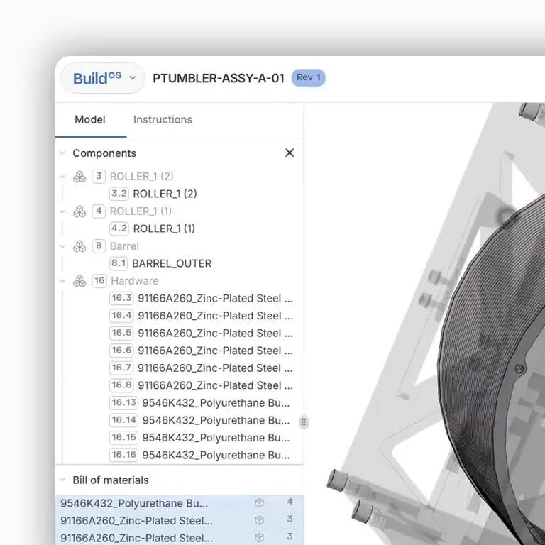
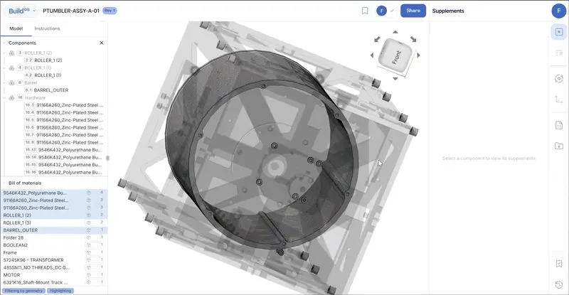
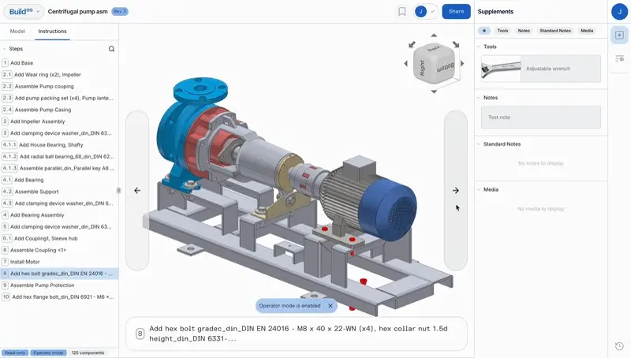

Today, Dirac announced the [release of BuildOS v1](https://www.diracinc.com/resources/dirac-launches-buildos-v1-the-automated-solution-for-model-based-work-instructions), the automated solution for model-based work instructions. I led the front-end rebuild of Dirac's flagship application, an industrial interface for manufacturing engineers working with complex mechanical assemblies. The goal: make model-based work instruction creation feel fast, legible, and intuitive. From a blank canvas, we architected and implemented a new system using React, TypeScript, Redux Toolkit, and Vite.

At its core is a performant, virtualized tree component powered by a recursive data model I designed from the ground up to mirror CAD hierarchies and serve as the foundation for the entire application. This structure underpins everything: step editing, animation sequencing, part annotations, and the binding of tribal knowledge to geometry. I implemented both the UI library and its gRPC-based integration with our Go backend, enabling snappy, optimistic updates and a fluid editing experience. Load times dropped by over 90%.

I also contributed to API design, data modeling, and architecture across the full stack: JT/STEP uploads, CAD processing pipelines, file versioning, DynamoDB/Redis layers, simulation engines, and annotation tooling. In the absence of formal UX and product designers, I shaped the visual language of the application as both an engineer and a designer. We were building a new conceptual interface between digital geometry and human process.

My work lives throughout BuildOS v1: the kits system, tree-driven context resolution, live preview tools, and the infrastructure for programmatically generated instructions, now used by aerospace and automotive teams to compress days of work into minutes.
