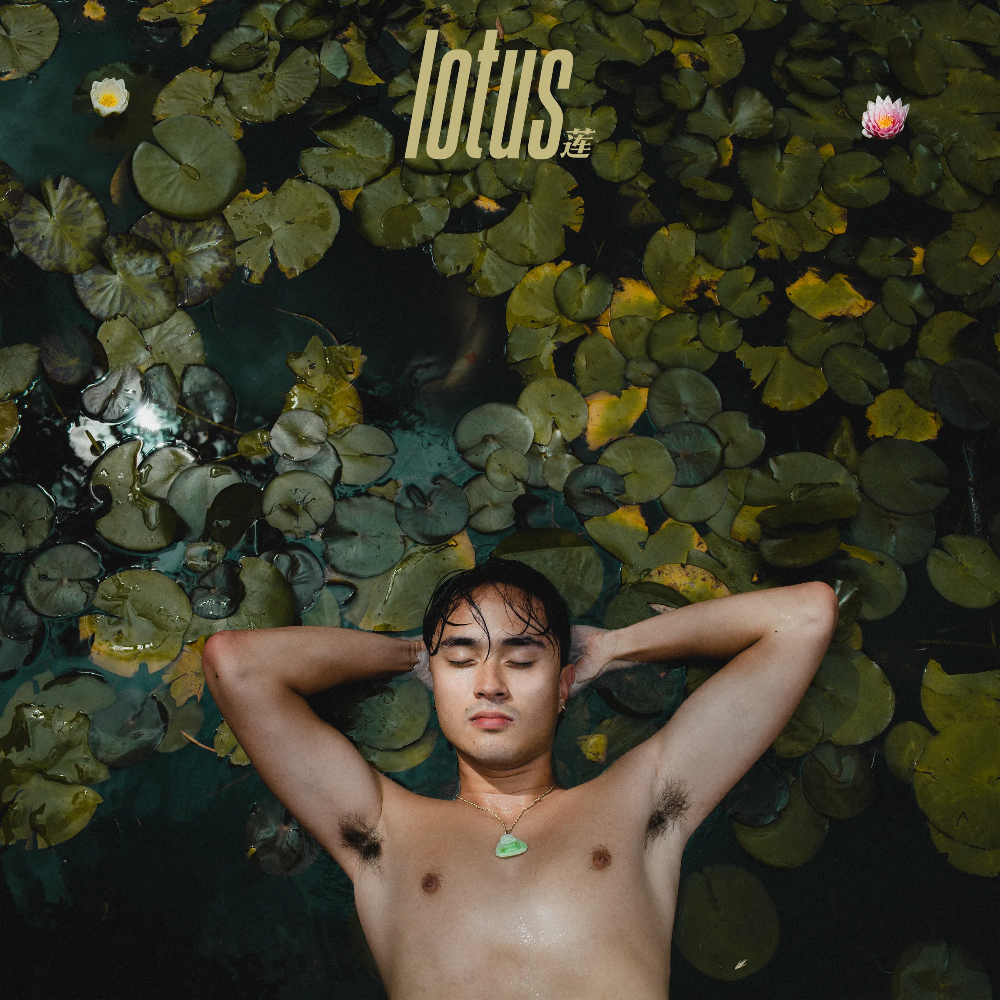
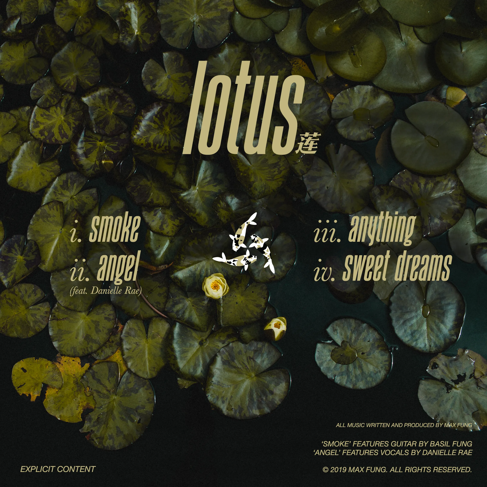
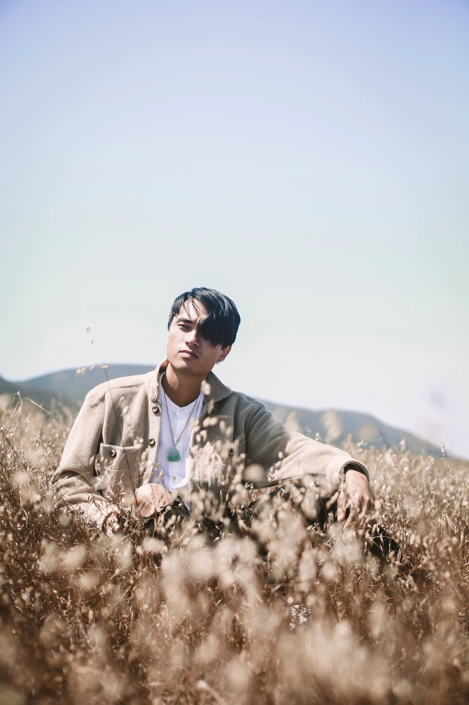
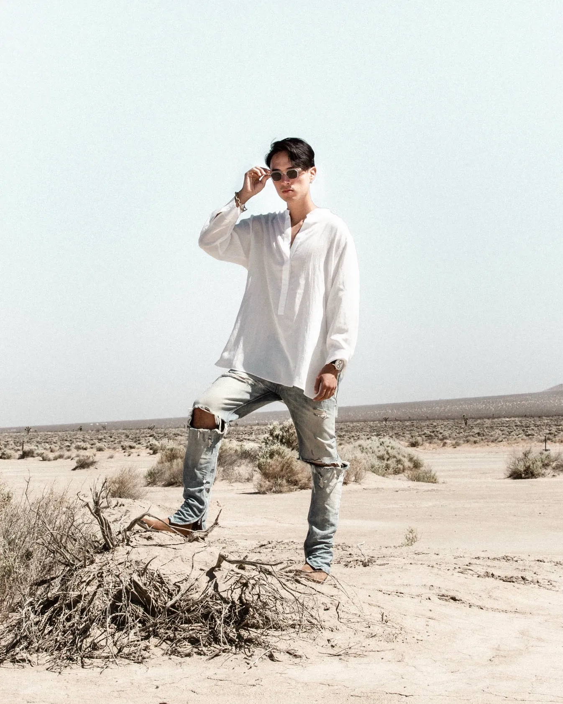

Five years ago, in the summer of 2019, I released my first solo EP which I had painstakingly written, produced, curated, and performed over the past two years. The songs explored the themes of loss, death, rebirth, and growth as I grappled with the pressures of young adulthood and a very painful breakup.

I worked closely with some tremendously talented friends to write, perform, photograph and film every single creative vision I had for the project with the goal of actualizing these ideas fully, without compromise. Danielle Rae provided vocals on the breakout track Angel, which received over 40,000 streams within the first month of release. [Chandler Locke](https://www.chandlerlocke.com/) and [Isabel Rist](https://www.isabelrist.com/) served as creative co-directors on all of the promotional material, and we worked closely to plan out shoots across various locations in Southern California for each individual track, as well as a merchandise line.

The cover came to me very clearly in a dream, and was shot at the lotus pond in the Kenneth Hahn Recreational Area in south Los Angeles. The photo is actually a few different shots of the pond superimposed, and I achieved the floating effect by placing my back on a small pool floaty and crunching extremely hard to stay horizontal over the water.

Each piece of media proved to be its own adventure. For the Smoke music video, we spent 8 hours burning up in the desert sun just outside of Victorville lighting fire to colored smoke grenades, recreating the Holi effect with chalk, and smashing a perfectly functional guitar. We rented a submersible housing for our camera equipment and took it into the Pacific Ocean at the Santa Monica pier to film the music video for Anything, and for Sweet Dreams, I was in and out of Isabel's family pool in order to achieve the aesthetic of being a human Lotus.

<iframe width="100%" height="400" src="https://www.youtube.com/embed/22mM4PnUYjg" frameborder="0" allowfullscreen title="Max Fung - Smoke (Trailer)" loading="lazy"></iframe>

<iframe width="100%" height="400" src="https://www.youtube.com/embed/G89Wpx9ex0U" frameborder="0" allowfullscreen title="Max Fung - Smoke [Official Video]" loading="lazy"></iframe>

<iframe width="100%" height="400" src="https://www.youtube.com/embed/O2LMWKSoY6U" frameborder="0" allowfullscreen title="Max Fung - Anything (Trailer)" loading="lazy"></iframe>

Two summers before Lotus, I met somebody who would change my life forever. We spent that entire summer together in each other's arms, sharing love, laughter, and a connection of unparalleled intimacy. We told each other our deepest thoughts and darkest secrets. These moments I experienced with her have left an impression on me that I will never be able to shed. I'll cherish that experience, for what it was, forever. But forever doesn't change the fact that things do always change, people will change, and the songs we sing change with them. It was much harder to let her go than I'd ever imagined letting go could be. I spent many nights exhausted by the emptiness her absence left. And on many early mornings, I was awakened by sounds of her voice and dreams of what we used to share together. I still remember all the places we went, all the things that mattered so much in that time. "Anything" was an attempt to escape the past I was trapping myself in. This is what was left of my world in that moment.

<iframe width="100%" height="400" src="https://www.youtube.com/embed/6UeD57wDPZc" frameborder="0" allowfullscreen title="Max Fung - Sweet Dreams (Trailer)" loading="lazy"></iframe>

When I worked on the beat for Sweet Dreams for the first time, I was tracking guitar with two other artists in the room, vibing. The loop was peaceful enough to put one of them to sleep, and it was here that the title was born. The beat sat dormant in my hard drive for months, until one day I felt inspired to include it on Lotus as the closing track for the EP. As I began writing lyrics, I remembered the lullabies my mother used to sing before bed when I was really little. A lyric that stuck with me in particular was from her rendition of "Dream A Little Dream of Me." From this place, I wanted to recreate a similar feeling of inner peace and serenity.

Sweet Dreams is the crescendo of the bloom; it is the self-realization and personal acceptance that took place in my life during its conception. It is a nod to the self-love, joy, and excitement I created for myself out of a place of darkness and doubt. At its core, it's a song about loving and being at peace in oneself. In its truest form, it is the end of the lotus' journey.

Special thanks to [Isabel Rist](https://www.isabelrist.com/) for her amazing photo work and for donating her family pool and a big palm leaf from her family tree, Nathan Burhans for support work during filming, Jake for shooting behind the scenes, Vince Vu for mixing, Carlos for curating the EP, and my mother for additional songwriting on this track. Without you all, this song and visual would not have been possible.

Lotus, to me, is a collection of songs that authentically describe my own self-discovery and rebirth of my passion for music and life after a tumultuous relationship and deep depression. The lotus grows out from the mud at the bottom of the pond, seeking the light at the surface, to eventually bloom for a day or two at a very specific time of year.

The concept behind the title is extremely relevant to my life. One evening, during meditation, my mother envisioned herself diving into a lotus pond and retrieving a child from the mud. Soon after this, she was gifted her first baby, and to this day swears that she found my soul in that pond.

The lotus flower is held sacred by many people throughout the world. To me it stands as a symbol for rebirth and enlightenment. Once you give it a listen, I hope that it will mean something special to you too.

[Listen to Lotus](https://album.link/xkrc4cgctwccj)

[More music](/music)
