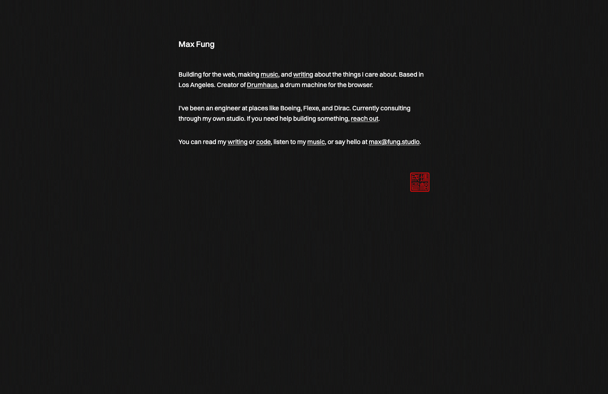

I redesigned my website again. This time, by deleting most of it.

My old site was built like a portfolio. It had a landing page with previews of everything, an about page with photos and a work history, a works page mixing software projects with music albums, and a writing section with category filters and a bold, animated header where each letter phased in with staggered timing.

It had dark mode and light mode, and a toggle for that. [React](https://react.dev/) components. [Framer Motion](https://motion.dev/) animations. A custom designed logo with SVG morphing. A navigation bar. A footer that said "Let's jam" with an animation that revealed my email when the user hovers. It looked great. It was my best design work yet.

After a little while though, something about it felt like it no longer suited me. It started feeling like the site was trying a little too hard. Around the same time, I had some experiences with clients that revealed to me how important it is to prioritize simplicity over excess in execution of design and development.

That every line of code I add is a line of code I'll have to maintain and someday reckon with in the future. Every design I add carries weight, especially if the project ever takes a turn in direction.

## First Principles

Thinking in first principles is a useful philosophical concept that has been given a sour connotation due to its association with billionaire man child Elon Musk. Ignoring its association though, it's useful to think about any website in terms of what information it contains and what value it offers to the user.

My website is my doorstep to the internet. An ode to the small web. Carrying on the tradition of the personal website. But those ideas are more ephemeral. To put it bluntly, my website is an about page, a blog, and some links to my music. I realized I didn't need a separate works and writings section. I really wanted to showcase my discography. Any coding projects I worked on could be better contained in the writing section. I wasn't using this site to funnel sales or conversions. The animations, the branding, and everything else I had was noise.

This got me interested in changing my site by stripping it down to its most bare elements. I had gone through this process before when designing [Drumhaus](https://drumha.us), my passion project, and I wrote about it extensively [here](/writing/announcing-drumhaus-v1). Every single piece of code and UI on screen needed to justify its usefulness and thus earn its place, or get cut out. I won't claim this is my original idea, it's just relevant that every person who makes things must reckon with this reality at one point or another.

I also started looking at personal sites that I genuinely admired. I described these feelings to [Claude](https://claude.ai/) and [Gemini](https://gemini.google.com/), and interestingly enough they were able to point me to quite a few other designers and developers, no follow-up questions asked. Some highlights of this group include [shud.in](https://shud.in/), [leerob.com](https://leerob.com/), and [frankchimero.com](https://frankchimero.com/).

I liked how the simplicity of each design lent itself to the overall polish of the work. I enjoyed how content was emphasized. How typography and negative space actually create a sense of enclosure and completeness in the absence of visual excess. They also emanated an aura of pragmatism, which I have increasingly grown to value over the years working as a developer.

Each of these sites is radically minimal. They lacked hero image, project card grids, and complex UI. They leaned heavily on text and substance. Lee Robinson's site lacked a traditional navigation bar. You discovered the links by reading — a concept I incorporated into my landing page. Frank Chimero's site practices what he preaches about restraint in design. Shu Ding's site was mostly whitespace around quality content.

I loved their confidence to let content speak for itself. Restraint applies just as much to design as it does to code. I wanted my site to practice that ethos in a practical way.

## What I cut

I knew the first place to start was to cut. I was certain I didn't want to keep updating my head shots and CV for my About page. I was curious how much bundle size I could shave off by being radically simplistic. React had to go, because there wasn't really anything complex enough in my site that justified its use. The morphing SVG was a beautiful experiment, but I grew unhappy with my Illustrator work and didn't mind cutting it. The details on that are partially preserved in [this post](/writing/harmony-exploring-logo-design).

I removed the about page, the works page, the manifesto page, the category filters, the work experience timeline, the photo galleries, and the dark/light toggle. I removed the mobile navigation menu, the CTA sections, the project cards, the "Let's jam" footer.

The numbers tell the story:

- 45 components down to 7
- 73 source files down to 27
- 3,068 lines of source code down to 1,114
- 36 dependencies down to 22
- Client-side JavaScript shipped to the browser: zero

The site went from React islands with hydration directives and inline scripts to a fully static [Astro](https://astro.build/) site with no JavaScript on the client at all. Animations are pure CSS now, just how I like it. A subtle `fade-in-up` on page load, and Astro's view transitions using the browser's native [View Transitions API](https://developer.mozilla.org/en-US/docs/Web/API/View_Transition_API) for a blur-fade between pages. Subtle polish, and best of all, no library needed. To me, this sort of restraint feels really good to implement. CSS will always beat React on compute and efficiency strictly due to the nature of the browser engine. It's best to use the right tool for the job, and knowing the right tool is half the battle.

The color palette collapsed too. The old site had 12 CSS custom properties covering primary, secondary, accent, muted, and ring colors in both light and dark variants, something I carried over from [shadcn/ui](https://ui.shadcn.com/). The new site has 7 shades of gray. Pure monochrome [OKLCH](https://oklch.com/) with zero chroma. OKLCH has piqued my interest recently. I don't really understand it, but I've heard it allows for a wider range of possible colors, and that warrants its inclusion. Now there's just one font — [Switzer](https://www.fontshare.com/fonts/switzer). I've loved Swiss typefaces since I was like 13, when I discovered Helvetica from New York City MTA signs. I digress. Two arrow icons for previous/next navigation. I will always include [Lucide](https://lucide.dev/) whenever I can for its treeshaking. That's it.

## What's left

A homepage with my name and a few sentences about what I do, with inline links to the rest of the site. A writing page with just titles and dates, no categories, no filters, no bold invitation to enjoy. I realized the work was done anyway when the user clicked on the link. A music page with my album covers displayed proudly. A simple content page for my posts with a streamlined layout that emphasizes readability.

A Chinese seal stamp on the landing page as the single non-grayscale element on the entire site. An homage to my Cantonese grandparents who immigrated to the United States by way of Hong Kong and San Francisco. The seal depicts my Chinese name — Fung Gee Sing (馮智成) — where 智 means wisdom and 成 means to accomplish, plus an additional character, Yan (印), meaning "Seal of." Tangential to this effort, I've recently been connecting more and more with my Chinese heritage, and it's finally something I'd like to wear proudly on my site. I used a round variant of this design for the site's favicon. Leaning into a text-based site, it felt right to give my stamp of approval somewhere. [^1]

[^1]: The surname 馮 (Cantonese: fung4, Mandarin: féng) traces back to the state of Feng during the Spring and Autumn period and combines the radical for horse (馬) with strokes suggesting speed. 智 (Cantonese: zi3, Mandarin: zhì) is one of the five Confucian virtues — alongside benevolence, righteousness, etiquette, and integrity — and goes beyond mere knowledge (知) to imply judgment and the ability to act on understanding. The character first appeared over 3,000 years ago on oracle bones. 成 (Cantonese: sing4, Mandarin: chéng) originally meant "city walls" — defending a city with an axe — a meaning preserved in the related character 城. The 印 (Cantonese: jan3, Mandarin: yìn) suffix is a traditional convention on Chinese name seals, also called "chops," a term adapted from the Hindi _chapa_. The full seal reads 馮智成印: "Seal of Fung Gee Sing."

The content model simplified too. Software projects that had their own detail pages with image galleries became writing entries instead. The work speaks through the post, not through a portfolio layout. An audit trimmed the writing collection from 12 posts down to 10. Pieces that didn't hold up or had too much AI assistance got cut, prioritizing quality over quantity.

Everything about the site is now narrower. `max-w-5xl` for the outer container. `max-w-2xl` for the homepage and body text. The narrowing is the point. Less width also means less responsive layouting to declare, less visual noise, more focus on the words.

## Why less

> Perfection is achieved not when there's nothing more to add, but when there's nothing left to take away.
>
> <cite>[Rick Rubin](https://en.wikipedia.org/wiki/Rick_Rubin)</cite>

A personal website is one of the few things in life where you have total control. There's nobody else telling you what to do or how to do it. The temptation is to use that freedom to add — to showcase, to impress, to build something that proves you can. But the lesson I've learned is that the discipline is in the other direction. Every component I wrote was another component I'd have to maintain. Every feature was another thing that could break, go stale, or distract from the writing. Every design meant more visual noise, more complexity, more dissonance.

The site has one job: present what I do. A tangential job might be to represent who I am. The constraint is the clarity. I took great pleasure in removing each piece, meticulously adding back in only what supported my goal. No need for light and dark mode. No need for fancy animations that distract. Every line of code is expensive.

Treating minimalism as an aesthetic misses the point. The aesthetic is the result, not the means. Minimalism in design and engineering should be regarded as a developmental philosophy. Function must be prioritized before form. This design can only exist because I thought long and hard about what my site should be. What it will do, what it will say, what it will represent. Now there's less code to maintain. Less surface area for bugs. Less cognitive overhead when I sit down to write a new post. It's my view that the site should get out of the way. Designs like these last longer because they don't do too little and they don't do too much.

## The site now

296 lines of CSS. 6 components. Zero JavaScript in the browser. Monochrome. One font. A two-layout system — one for the centered homepage, one for everything else. OG images generated at build time with [satori](https://github.com/vercel/satori) and [sharp](https://sharp.pixelplumbing.com/) instead of a static fallback. Deployed to [Cloudflare](https://pages.cloudflare.com/).

It's the smallest and simplest version of this site that has ever existed, and I think it might be the best one. Not because it does the most, but because everything that remains earned its place. I have more code to write. Here there is content. Now that the design is out of the way, the words can be clearer.

Here's to having nothing left to take away.
